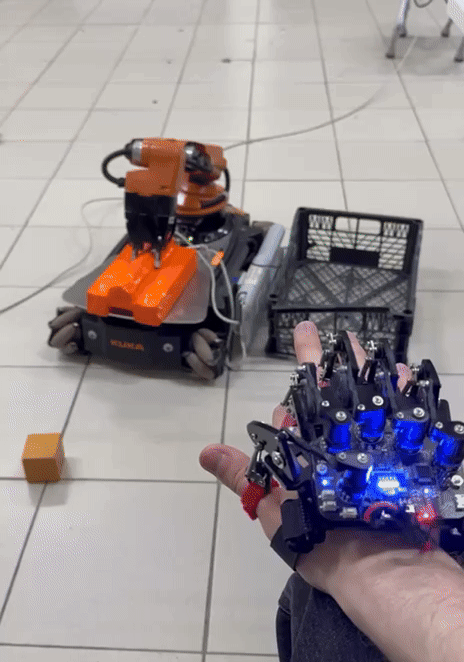
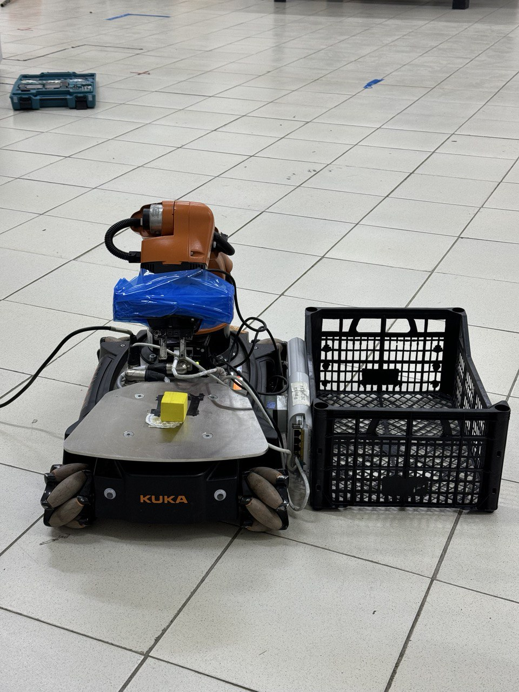
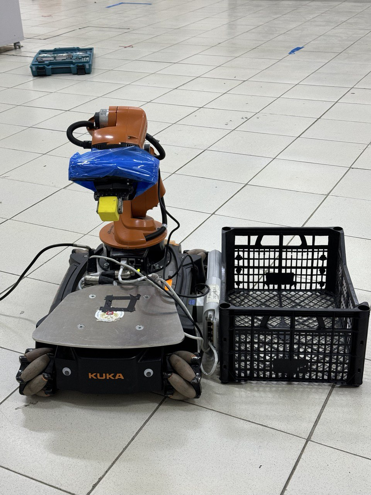
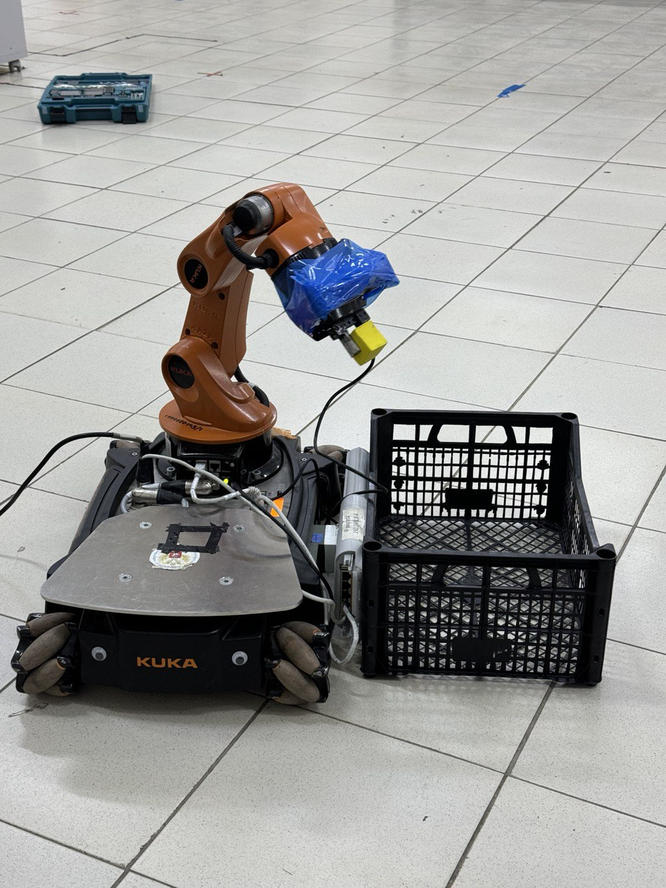
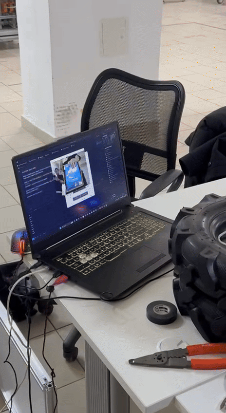
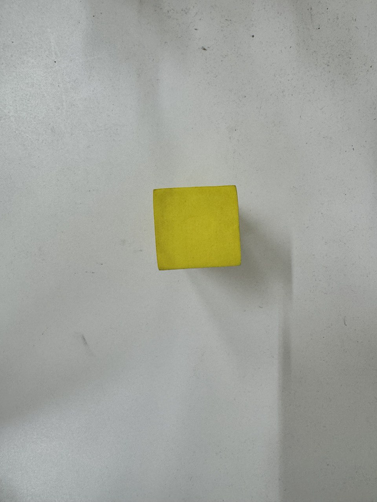
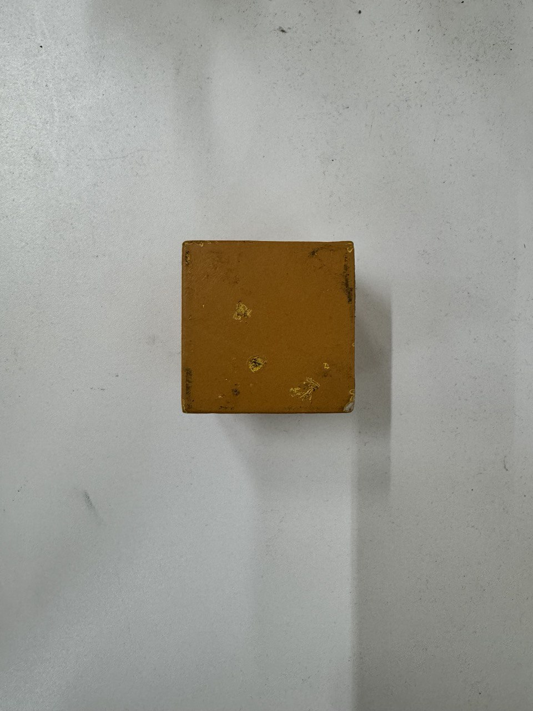
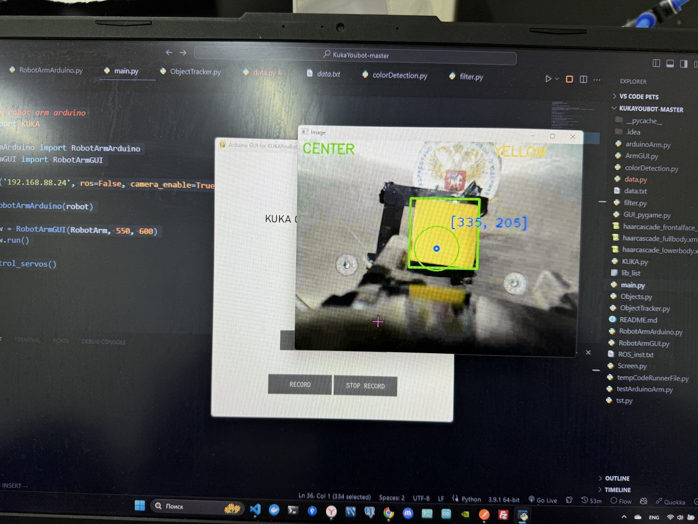
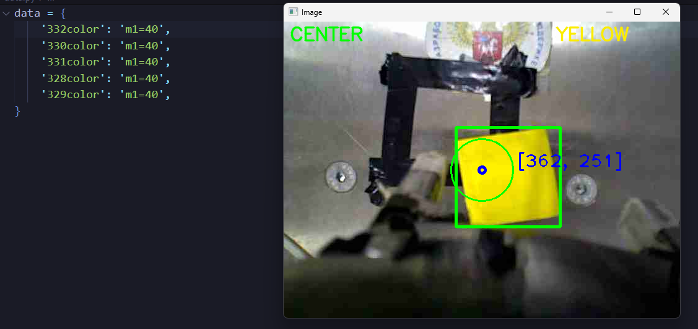
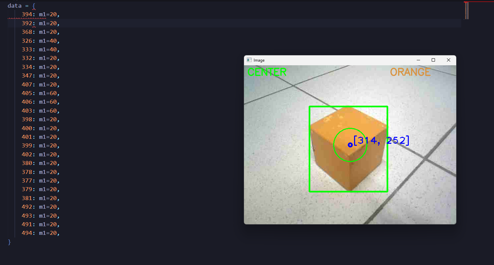

# KUKA YouBot Control with Hiwonder Somatosensory Gloves

This project integrates an Arduino-controlled robotic arm with a KUKA YouBot robot, enabling advanced manipulation and object sorting. The robot is equipped with a camera that allows real-time analysis of objects based on their color and size. This capability provides a platform for training the robot to classify and sort objects dynamically, making it adaptable to a variety of tasks. The combination of Arduino control, computer vision, and machine learning opens up numerous possibilities for automation and object handling.

<table align="center">
  <tr>
    <td>
      
    </td>
     <td>
      
    </td>
     <td>
      
    </td>
  </tr>
</table>

A user interface (UI) was created to facilitate interaction with the system. The UI allows switching between an automatic mode, where objects are detected using the camera, and a manual mode, where the robot interacts with objects using a glove-controlled robotic arm. This dual-mode functionality provides flexibility in operation, enabling both automated object handling and direct manipulation through the glove interface.

<table align="center">
  <tr>
    <td>
      
    </td>
     <td>
      
    </td>
      <td>
      
    </td>
  </tr>
</table>

  
  

For object detection, the OpenCV library was used. With its help, the KUKA YouBot camera was able to detect objects, determine their size and color, enabling accurate and real-time sorting. As a test, two cubes of different colors, orange and yellow, were used to evaluate the system's performance in detecting and sorting objects based on their characteristics.

<table align="center">
  <tr>
    <td>
      
    </td>
     <td>
      
    </td>
  </tr>
</table>

The camera is focused on the object, where it determines its color and size. Based on these values, the data signals from each potentiometer are stored in a file called **memory_store**. This functionality can be customized to record commands that the robot must execute. These commands are stored in the file and are accessible by key within the object found in memory_store. As a result, when the camera is powered on, the robot can automatically retrieve information from the file using the key and interact with the object by reading the commands stored in the file.

  

  

  

## Overview of the KUKA class (User manual):

The KUKA class is written for convenient operation with the KUKA youbot robot using the Python programming language. The class has several basic methods for controlling the robot.

source: https://github.com/MarkT5/KUKAyoubot_lib

## Parameters when creating a class element

**_ip_** _(str)_: robot ip

**_pwd_** _(str)_: password for ssh connection

**_ssh_** _(bool)_: whether to connect to SSH or not

**_ros_** _(bool)_: force restart of youbot_tl_test on KUKA if true

**_offline_** _(bool)_: toggles offline mode (doesn't try to connect to robot)

**_read_depth_** _(bool)_: if false doesn't start depth client

**_camera_enable_** _(bool)_: enables mjpeg client if True

**_advanced_** _(bool)_: disables all safety checks in the sake of time saving

**_log_** _[(str), (int)]_: [path, freq] logs odometry and lidar data to set path with set frequency

**_read_from_log_** _[(str), (int)]_: [path, freq] streams odometry and lidar data from set log path with set frequency

## Basic Methods

**_move_arm(...)_** — Sets arm position

ways to set arm position:

array of values:

- (joint 1, joint 2, joint 3, joint 4, joint 5, grip) - degrees from upright position

by keywords:

- **_m1, m2, m3, m4, m5_** - for joints **(all joint parameters are relative and in degrees from upright position)**
- **_grip_** - (0 - 2) for grip

**_move_base(f, s, ang)_** — принимает:

1. **_f_** — speed of movement along the axis along which the robot is directed, if positive — forward movement, if negative — backward,
2. **_s_** — speed of movement across the axis along which the robot is directed
3. **_ang_** — angular velocity
   if you call this method without specifying arguments, a stop command will be sent.

**_go_to(x, y, ang)_** — sends the robot to the x, y coordinates and sets the angle from the x axis to the direction of work (in meters)

**_post_to_send_data(ind, msg)_** — Writes the msg message to the ind sending cell (it is used by other methods to communicate with the robot, but it can also be used to send user commands if it is called with the index 3. 0 is the speed of the platform, 1 is the position of the manipulator, 2 is the position of the gripper)

**_camera/camera_BGR()_** _returns: (cv2.Mat)_- returns an image in a special compressed format

**_depth_camera()_** _returns: (cv2.Mat)_ — returns the image from the depth camera

### Properties:

**_arm_** _returns: float[6]_ — arm_id, joint 1 - joint 5

**_wheels_** _returns: float[4]_ — wheel 1 - wheel 4

**_lidar_** _returns: ([float[3], float[lidar_resolution]])_— returns an array with a length of 623 with distances to points evenly distributed from 0 to 240 degrees and odometry data linked to this measurement

**_increment_** _(returns: float[3])_ — returns an array with positions on the x, y axis and the angle from the x axis to the direction of the robot

## SSH:

**_send(msg)_** msg (string) - send a command via SSH

**_send_recv(msg)_** msg (string) - send the command via SSH and wait for it to complete
**_send_wait(msg_send, wait_msg, timeout=None, timeout_msg=None, verbose=0, max_time=20):_**

- msg_send (string)- message to send
- wait_msg (string)- the response that will be expected
- timeout (int)- maximum waiting time for the next response
- timeout_msg (string)- message that will be printed to the command line if the timeout is exceeded
- verbose (int)- 0- do not print information, 1-print only important information, 2-print all received responses
